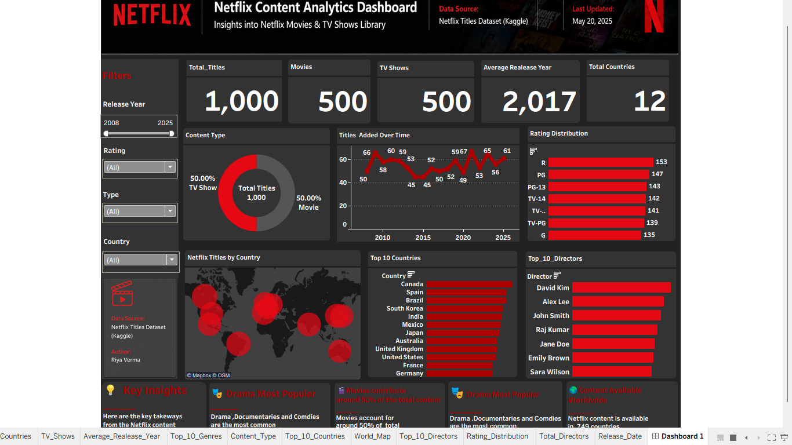

# 📺 Tableau Netflix Dashboard

## 📌 Project Overview

This project is an interactive Tableau dashboard built using the Netflix Titles dataset. It provides insights into Netflix's content library through interactive charts and visualizations.

## 📊 Dashboard Features

- Total Movies & TV Shows
- Content Distribution by Type
- Ratings Analysis
- Genre Analysis
- Country-wise Content Distribution
- Release Year Trend
- Interactive Filters

## 🛠️ Tools Used

- Tableau
- Microsoft Excel
- Data Visualization

## 📂 Dataset

- Netflix Titles Dataset (.csv)

## 🖼️ Dashboard Preview

## 📁 Files Included

- Netflix_dashboard.twb
- Netflix_Titles.csv
- Netflix_Dashboard.png

## 🎯 Project Objective

To analyze Netflix's content library and create an interactive dashboard that helps users explore trends in movies and TV shows.

---

⭐ If you found this project useful, consider giving it a Star!
